#   PayGrow - User Interface

**PayGrow** is a modern, secure, and intuitive digital wallet UI that simplifies cryptocurrency transactions. This project showcases the frontend of a crypto finance platform with features like OTP login, Google authentication, wallet management and chatbot assistance — all wrapped in a responsive design.

---

## 🚀 Features

- 🔐 **User Authentication**
  - Login/Signup system
  - OTP verification with account unblock support
  - Google OAuth2 sign-in

- 💼 **Wallet Management**
  - Add, Withdraw, and **Schedule Payments**
  - Set transaction PIN for added security
  - **Download transaction history as PDF**

- 💸 **Crypto Operations**
  - Buy/Sell cryptocurrency via form submission
  - Earn **PayCoins** as rewards for wallet top-ups

- 💳 **Profile Management**
  - View user profile after login
  - **Change transaction PIN** anytime securely

- 🔁 **UPI Integration**
  - **Request payments via dynamic QR code**
  - Auto-generates UPI link with transaction amount

- 📈 **Market Dashboard**
  - Crypto price tracking
  - Basic analytics and trading options

- 🤖 **Chatbot Assistant**
  - Answers crypto-related queries
  - Collects user phone numbers if issues are unresolved

- 🌐 **Fully Responsive Design**
  - Clean, animated, and accessible across devices

---

## 🧱 Tech Stack

- **Languages**: HTML5, CSS3, JavaScript (Vanilla)
- **Design**: Figma (Wireframes & Prototypes)
- **Libraries & Tools**:
  - [Google OAuth2.0](https://developers.google.com/identity)
  - [QRCode.js](https://github.com/davidshimjs/qrcodejs)
  - [Font Awesome](https://fontawesome.com/)
  - [Google Fonts](https://fonts.google.com/)
  - [SheetDB API](https://sheetdb.io/) – used for submitting Buy/Sell/Chatbot forms

---

## 🚀 Features

### 🔐 User Authentication

- **Login/Signup system**  
    
  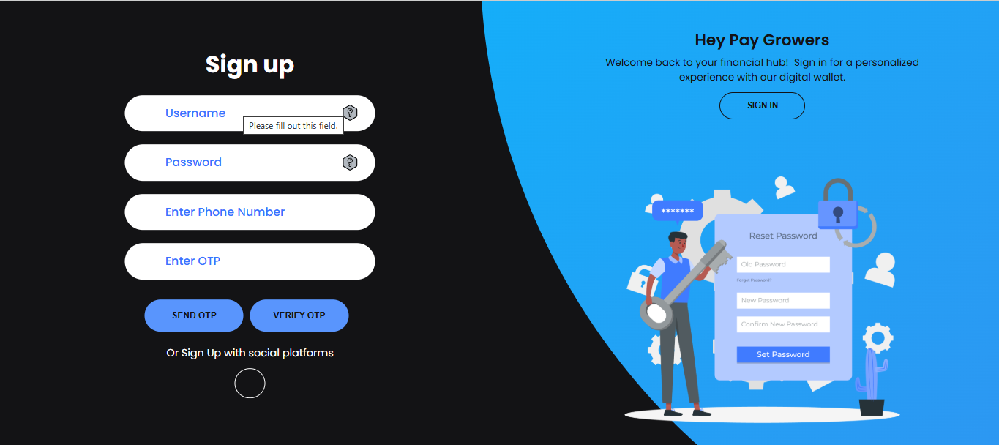

- **OTP verification with account unblock support**  
  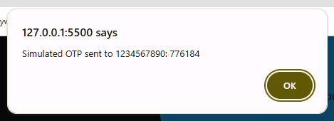  
  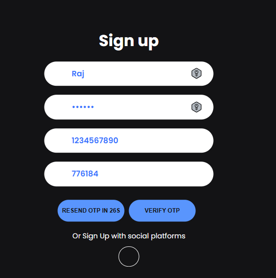

- **Google OAuth2 sign-in**  
  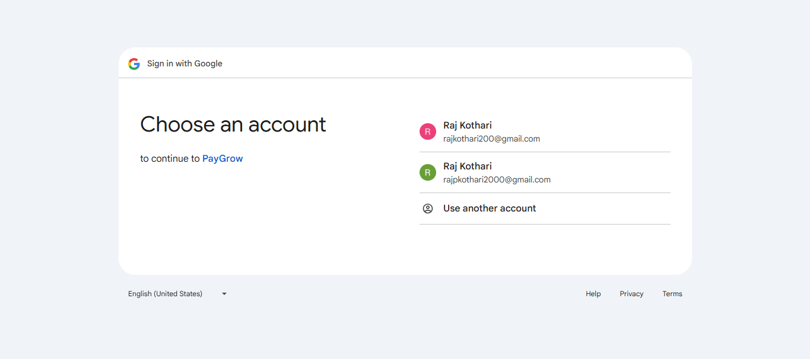

---

### 💼 Wallet Management

- **Add, Withdraw, and Schedule Payments**  
  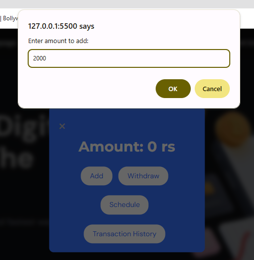  
    
  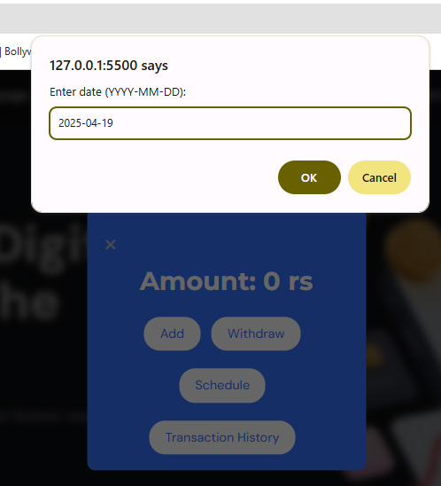  
  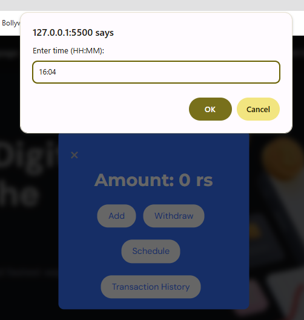

- **Set transaction PIN for added security**  
  *(Feature included in profile section below)*

- **Download transaction history as PDF**  
  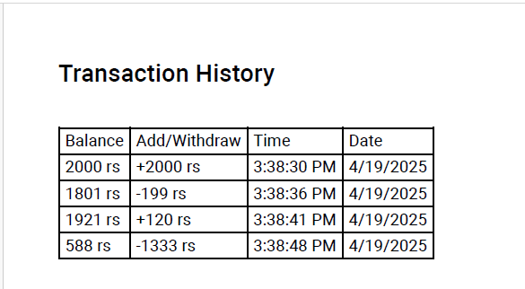

---

### 💳 Profile Management

- **View user profile after login**  
  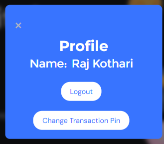

- **Change transaction PIN anytime securely**  
  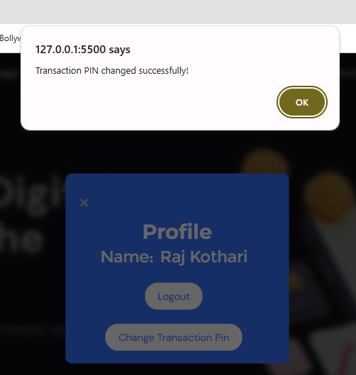

---

### 💸 Crypto Operations

- **Buy/Sell cryptocurrency via form submission**  
    
  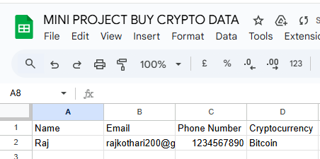  
  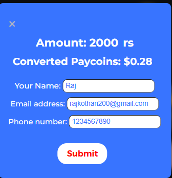  
  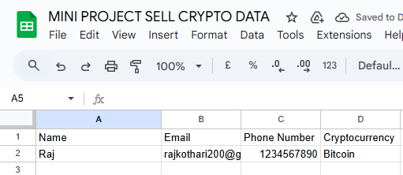

- **Earn PayCoins as rewards for wallet top-ups**  
  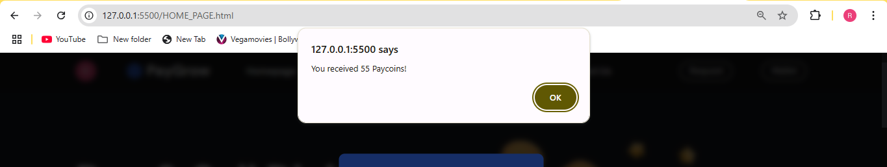

---

### 🔁 UPI Integration

- **Request payments via dynamic QR code**  
  

- **Auto-generates UPI link with transaction amount**  
  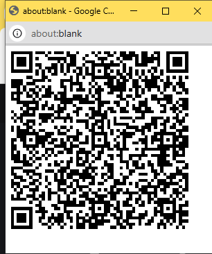

---

### 📈 Market Dashboard

- **Crypto price tracking**  
  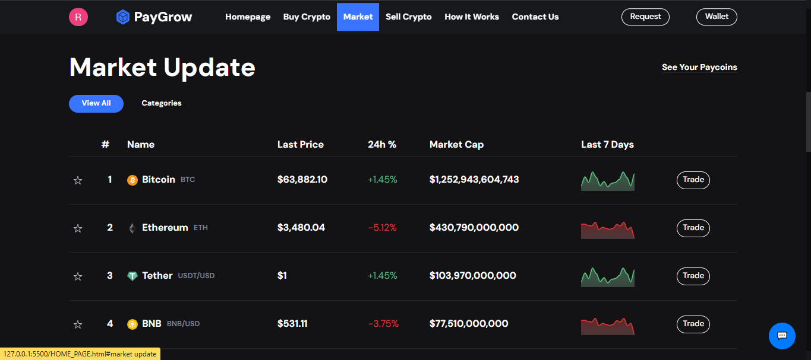

- **Basic analytics and trading options**  
  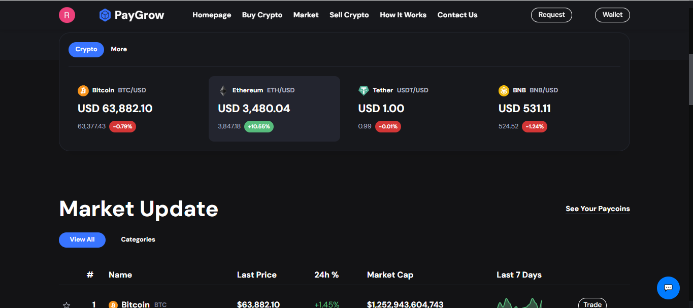

---

### 🤖 Chatbot Assistant

- **Answers crypto-related queries**  
  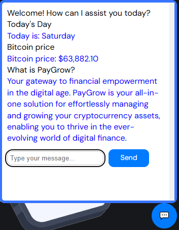

- **Collects user phone numbers if issues are unresolved**  
  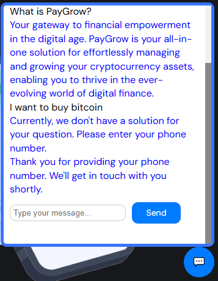  
  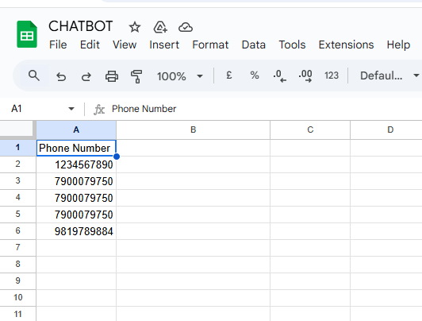

---

### 🌐 Fully Responsive Design

- **Clean, animated, and accessible across devices**  
  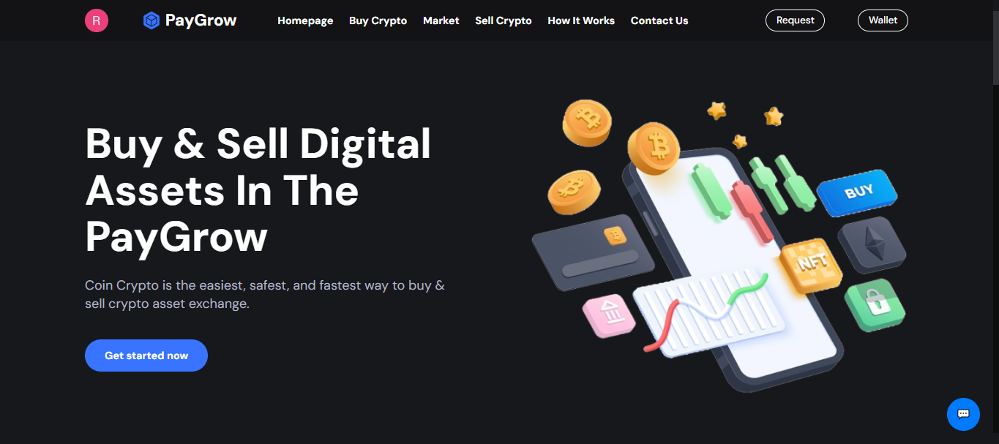  
    
    
  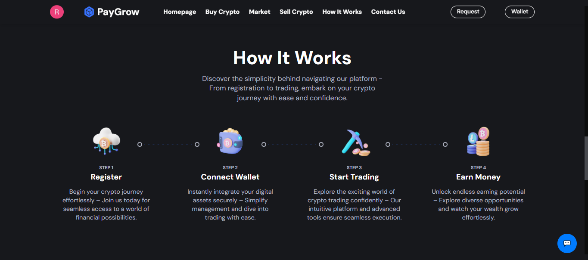  
  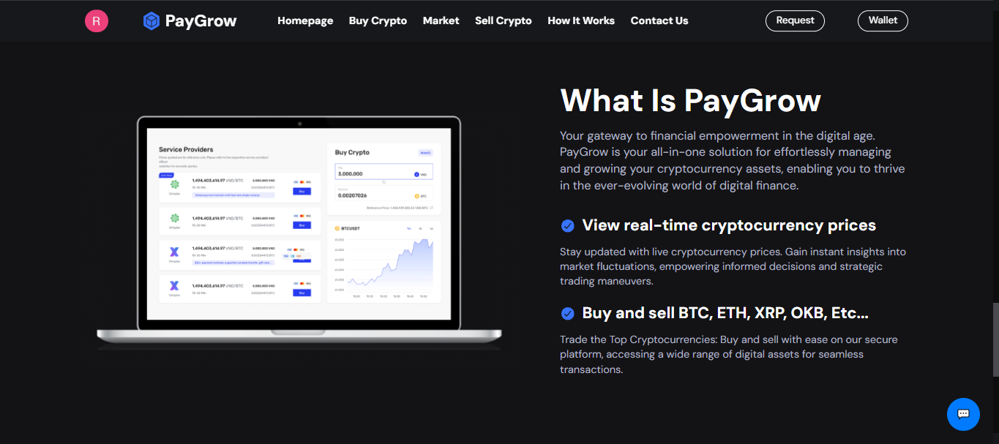  
  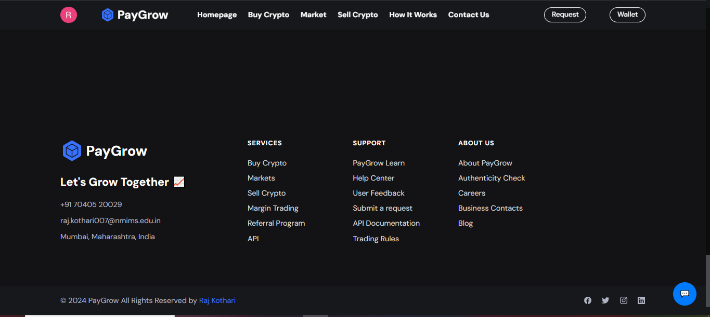  
  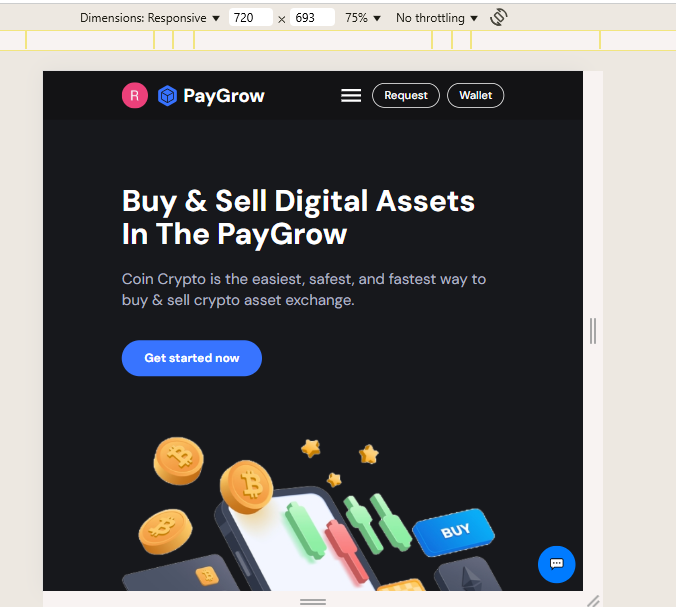

